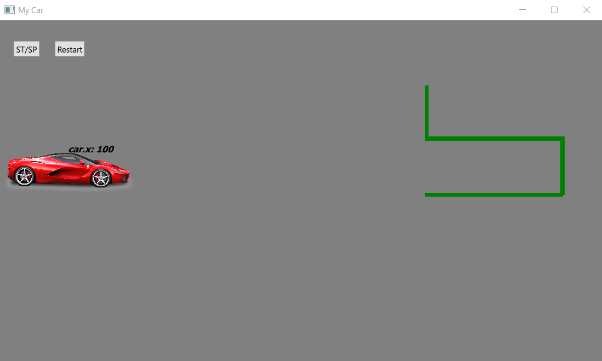
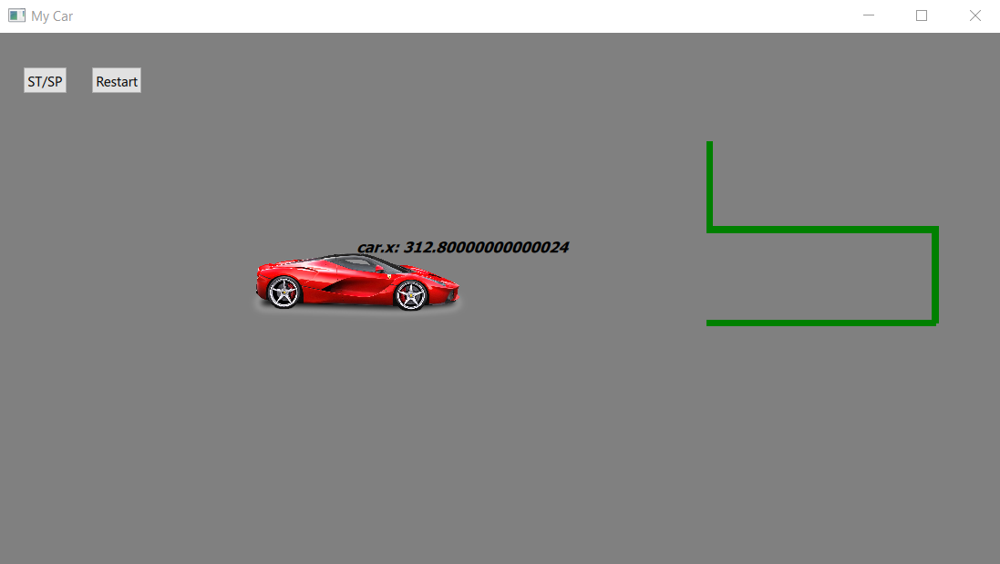
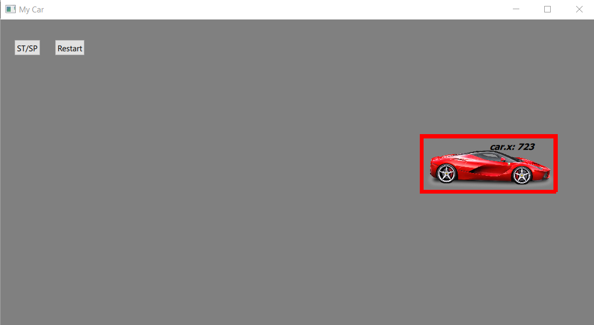
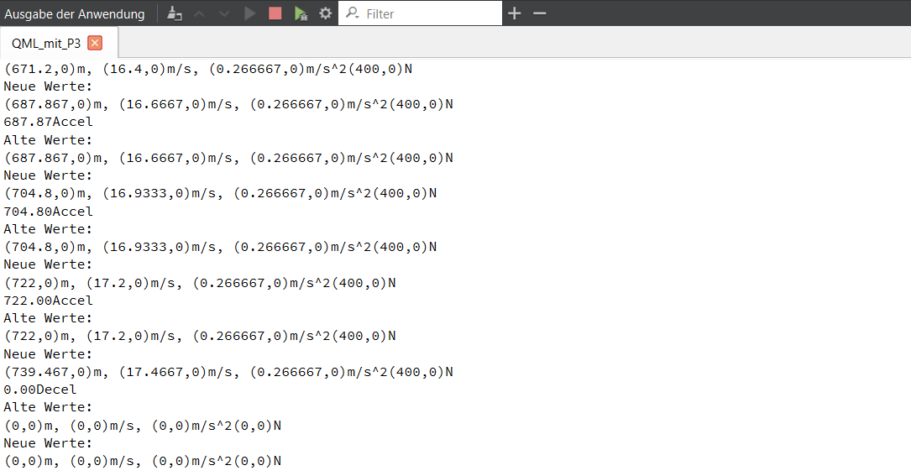

# C++ Project Using Qt and QML
- This project is essentially an extension of another project that consisted of simple structures and had no UI.
- This project is written with C++ classes and integrated with the UI using Qt signals and the QML language.
- The project simulates a car programmed with C++, considering physical quantities as well.
- The car can switch between different states to simulate a real car.

## Available States:
1. **Offstate:** The car is off.
2. **Neutralstate:** The car is in a neutral state, meaning it is on but still at rest.
3. **Accel state:** The car accelerates, and all values of position, speed, and acceleration are calculated.
4. **Deccel state:** The car can drive in reverse, but only when the car is in the neutral state.

## Additional Available Functions:
1. **Up:** The car can move in the positive Y direction.
2. **Down:** The car can move in the negative Y direction.
3. **Turn off:** The car can be turned off with a command, similar to starting the car.

These commands are executed by clicking a button, like the ST/SP button. The UI contains only two buttons intended for starting/stopping and restarting. Other functions such as Up, Down, and Reverse are present in the project but have not been integrated into the UI.

## Initial UI Appearance
- 

## UI Appearance When SP Button is Clicked
- 

## UI Appearance When the Car Reaches the Goal
- 

## Values Calculated in the Background
- 
